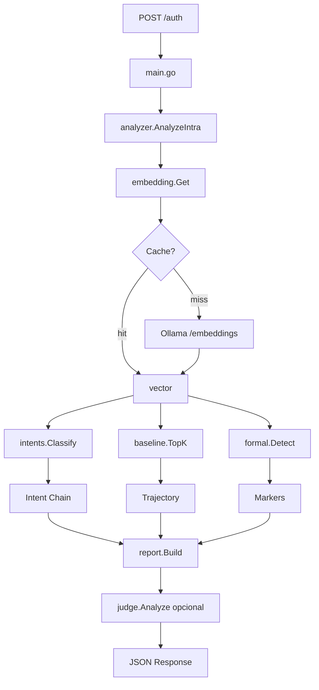

# DCS-Gate v8.7 — Arquitectura

## Árbol de directorios
```
dcs-gate-v8.7/
├── main.go              # rutas + handlers /auth, /evaluate, /calibrate, /health, /metrics, /auth/stream*, /stream-demo*
├── config.go
├── types.go
├── vec.go
├── cache.go
├── embedding.go
├── baseline.go          # triple baseline (core / shadow / edge) + TopKPerCorpus
├── intents.go           # 20 intents (16 v8 + HOLD_OPEN / PROBE / CALIBRATE / REPAIR)
├── formal.go            # 14 formal markers
├── morphology.go
├── analyzer.go          # AnalyzeIntra → split, embed, classify, markers, trayectoria
├── judge.go             # Analyze() bloqueante + AnalyzeStream()* NDJSON
├── filter.go            # sanitizeChunk() — redacción conservadora para SSE  ★ NUEVO v8.7
├── stream.go            # authStreamHandler — SSE handler para /auth/stream  ★ NUEVO v8.7
├── stream_demo.go       # streamDemoHandler — UI HTML embebida              ★ NUEVO v8.7
├── stream_test.go       # 6 tests del protocolo SSE                          ★ NUEVO v8.7
├── filter_test.go       # 16 tests de redacción                              ★ NUEVO v8.7
├── report.go
├── evaluate.go          # Calibrate() grid search sobre golden tests
├── frontend.go          # UI legacy en `/` (intacto)
├── main_test.go         # ~50 unit tests
├── integration_test.go  # end-to-end con mock Ollama
├── go.mod
├── Dockerfile
├── docker-compose.yml
├── install.sh
└── data/
    ├── baseline_core.jsonl       # 36 vectores 1024d (GPT corpus)
    ├── baseline_shadow.jsonl     # 13 vectores 1024d (Gemini corpus)
    ├── baseline_edge.jsonl       # 12 vectores 1024d (mixto edge)
    ├── baseline_vectors.jsonl    # pool plano legacy (backward compat)
    ├── poles_1024.json
    ├── intent_prototypes.json    # 20 intents, ~8 prototypes c/u
    ├── formal_markers.json       # 14 markers
    ├── corpus_core.json          # corpus anotado 36 bloques (no embebido)
    ├── corpus_shadow.json        # 13 bloques
    ├── corpus_edge.json          # 12 bloques
    └── golden_tests.json         # 21 casos
```
★ = nuevo en v8.7. El resto se hereda de v8.6.5.

## Descripción por archivo

| Archivo | Propósito | Conexiones |
|---------|-----------|------------|
| **main.go** | Entrada. Inicializa config, embedder, baseline, intents, formal, judge. Expone HTTP :8080 (`/auth`, `/evaluate`, `/calibrate`, `/health`, `/metrics`). | Orquesta todo |
| **config.go** | Lee ENV (PORT, OLLAMA_URL, EMBED_MODEL, JUDGE_MODEL, thresholds). Defaults: all-minilm, wizardlm2:7b, INTENT_THRESHOLD=0.45 | Usado por main, embedding, judge |
| **types.go** | Structs API: AuthRequest, AuthResponse, IntentStep, Marker, Trajectory | Base común |
| **vec.go** | Operaciones vectoriales: normalize, cosine, dot, topK | baseline, intents, analyzer |
| **cache.go** | LRU en memoria para embeddings, con stats hits/misses | embedding |
| **embedding.go** | Cliente Ollama `/api/embeddings`. Get() con cache, GetMany() | Usa cache, config |
| **baseline.go** | Carga baseline_vectors.jsonl y poles_1024.json. Calcula top-K y pole score | analyzer |
| **intents.go** | Carga intent_prototypes.json, BuildCentroids() con embedder, clasifica frases | embedding, vec |
| **formal.go** | Carga formal_markers.json, detecta marcadores léxicos | analyzer |
| **morphology.go** | Rasgos morfológicos: verbos mentales, preguntas, longitud | analyzer |
| **analyzer.go** | Núcleo. AnalyzeIntra() → split frases → embedding → intent → markers → trayectoria | Usa embedding, baseline, intents, formal, morphology |
| **judge.go** | Cliente Ollama `/api/generate`. Analyze() y Refine() | main |
| **report.go** | Construye reporte final con autenticidad, predictibilidad, formulaicidad | analyzer + judge |
| **evaluate.go** | Ejecuta golden_tests.json, compara chains/markers, Calibrate() grid search | analyzer |
| **frontend.go** | HTML/CSS/JS embebido, sirve UI en `/` | main |
| **main_test.go** | Placeholder para unit tests | — |
| **integration_test.go** | Ping a /health | — |
| **data/** | Vectores y prototipos precomputados | — |

## Flujo de petición



## Datos

- **baseline_vectors.jsonl**: ~10k vectores 1024d
- **poles_1024.json**: eje positivo/negativo
- **intent_prototypes.json**: 8 intenciones con ejemplos
- **formal_markers.json**: tokens para OPENING_EMOJI, PERFORMED_HUMILITY_LEX, etc.
- **golden_tests.json**: 3 casos anotados (A/B/C)

## Notas de implementación v6 (histórico)

- BuildCentroids se lanza en goroutine (riesgo de race, corregir en v6.1)
- INTENT_THRESHOLD default 0.45 es bajo (recomendado 0.55)
- Frontend embebido evita problemas de build Docker
- Todo corre en CPU, <150MB RAM

## Streaming v8.7 — diseño

### Diagrama de la ruta SSE
```
POST /auth/stream { question, response, mode }
   │
   ▼
authStreamHandler (stream.go)
   │
   ├─► SSE headers + http.Flusher check
   │
   ├─► analyzer.AnalyzeIntra(response)          ~300-500 ms
   │       └─► emit "pre_analysis" event
   │
   ├─► emit "judge_loading" event {model}
   │
   ├─► spawn goroutine: judge.AnalyzeStream(ctx, ..., events)
   │       │
   │       ├─► POST Ollama /api/generate {stream:true, think:true}
   │       │
   │       └─► bufio.Scanner sobre NDJSON
   │              │
   │              ├─► chunk.thinking != "" → sanitizeChunk + emit "thinking_chunk"
   │              │
   │              ├─► chunk.response != "" (primera vez) → emit "thinking_complete"
   │              │
   │              ├─► chunk.response != "" → sanitizeChunk + emit "analysis_chunk"
   │              │
   │              └─► chunk.done → break, parsear JSON acumulado
   │                      ├─► OK → emit "complete" {AuthenticityAnalysis + judge_thinking}
   │                      └─► fail → emit "parse_error" {thinking, raw_response}
   │
   └─► range over events channel
           └─► fmt.Fprintf SSE format + flusher.Flush() por evento
```

### Contratos de paridad
- `/auth` y `/auth/stream` usan el mismo prompt del juez (ver `ANALYZER_PROMPT`
  en `judge.go`) sobre el mismo pre-análisis. Diferencia única: `stream=true`
  y `think=true` (cuando aplica) en el request a Ollama.
- El `complete.AuthenticityAnalysis` es bit-a-bit equivalente al
  `AuthResponse.Analysis` del endpoint clásico para inputs deterministas.
- `TestAuthStreamParity` (stream_test.go) lo verifica con mock Ollama.

### Sanitización
`filter.go::sanitizeChunk()` se ejecuta SIEMPRE antes de emitir
`thinking_chunk` o `analysis_chunk`. Política over-conservative:
14 patrones (OpenAI / AWS / Google / GitHub / Slack / Bearer / paths
/ credenciales / tokens largos). El último patrón (40+ caracteres
alfanuméricos) es un catch-all; corre al final para no preceder a las
reglas específicas.
